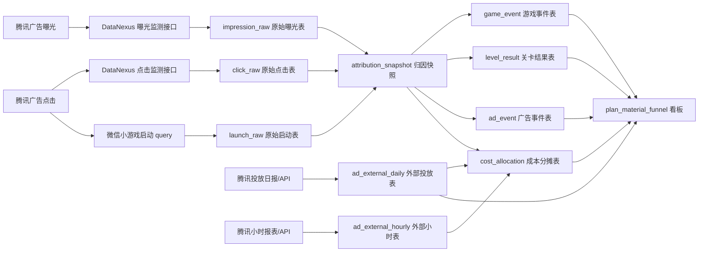

# docater1 投放归因系统重写与打点日志方案

> 日期：2026-06-18  
> 适用范围：`轻松拼豆 / 拼豆豆` 微信小游戏后续投流、内部日志、投放看板重构  
> 核心目标：后续每个广告带来的用户，都能稳定关联到计划、素材、批次、点击、首局漏斗、广告变现和腾讯侧消耗，避免再次出现“CTR 类似但不知道进游戏后发生了什么、也不知道钱花在哪一步”的问题。

## 1. 先给结论

`docater1.cn` 这个系统可以视为你们现在的老投放归因/投放看板系统。它不是腾讯广告后台本身，而是把腾讯投放数据、素材配置、启动参数、游戏侧回传和 ROI 数据聚合到一起的内部/供应商系统。

从截图、已保存页面和 SDK 代码反推，老系统里大概率已经有这些关键字段：

| 老系统页面名 | 老系统代码字段 | 推断含义 | 新系统建议字段 |
| --- | --- | --- | --- |
| 计划ID | `cid` | 老系统的投放计划主键或外部计划 ID | `docater_cid` |
| 自定义ID | `tunnel_id` / `customId` | 老系统“隧道/入口/自定义计划”ID，计划名最后一段常见 `10114641` | `docater_tunnel_id` |
| 批次号 | `batch_no` | 一次上传/创建/同步批次 | `docater_batch_no` |
| 素材ID | `materialId` | 单个素材 ID | `docater_material_id` |
| 素材ID集 | `materialIds` | 一个计划绑定的多个素材 | `docater_material_ids` |
| 素材 | `images` | 素材预览、视频首帧、图片/视频地址 | `material_assets` |

最重要的判断：

- 老系统里的“计划ID”不要直接等同于腾讯官方 `campaign_id`。
- 老系统里的“自定义ID / tunnel_id / customId”也不要直接等同于腾讯官方素材 ID。
- 新系统必须同时保存三套命名空间：腾讯官方字段、docater 老字段、我们内部实验字段。
- 消耗数据也必须接进来，但要分清两层：腾讯官方能提供精确的聚合消耗 `cost`，目前公开监测字段没有看到“单次曝光/单次点击实际扣费”字段；用户级、事件级成本应由我们基于聚合消耗做 `allocated_cost` 分摊，并标明这是派生成本，不是腾讯原始单次扣费。

## 2. 为什么要这么拆

腾讯广告官方字段有自己的含义。老系统的中文名是业务看板名，不一定等于腾讯字段名。

例如，腾讯点击监测文档里：

- `campaign_id / __CAMPAIGN_ID__`：旧版本广告的计划 id。
- `adgroup_id / __ADGROUP_ID__`：广告组 id，文档说明实际为广告 id。
- `ad_id / __AD_ID__`：旧版本广告 id，文档说明实际为创意 id。
- `dynamic_creative_id / __DYNAMIC_CREATIVE_ID__`：新版本广告创意 ID。
- `creative_components_info / __CREATIVE_COMPONENTS_INFO__`：创意组件信息。
- `element_info / __ELEMENT_INFO__`：素材信息。
- `material_package_id / __MATERIAL_PACKAGE_ID__`：素材标签 ID。

来源：腾讯广告点击监测链接使用指南  
https://developers.e.qq.com/docs/guide/conversion/new_version/dianjijiance

DataNexus 新版广告点击监测也说明，可以在监测链接里接收 `click_id`、`click_time`、`adgroup_id`、`dynamic_creative_id`、`creative_components_info`、`element_info`、`material_package_id` 等字段，并且广告主可以添加自定义参数，例如 `planid=123&channel=ams`。  
来源：https://test.datanexus.qq.com/doc/develop/guider/interface/conversion/ad_track_click

因此，新系统不要把一个字段笼统叫 `planId`。应该明确：

| 字段类别 | 示例字段 | 谁定义 |
| --- | --- | --- |
| 腾讯官方字段 | `tencent_campaign_id`、`tencent_adgroup_id`、`tencent_dynamic_creative_id`、`tencent_element_info` | 腾讯广告 / DataNexus |
| 老 docater 字段 | `docater_cid`、`docater_tunnel_id`、`docater_batch_no`、`docater_material_id` | 老系统 |
| 我们自定义投放字段 | `tf_experiment_id`、`tf_material_family`、`tf_entry_type` | 我们 |
| 微信启动字段 | `launch_scene`、`launch_query_raw`、`gdt_vid` | 微信小游戏启动参数 |
| 用户身份字段 | `wechat_app_id`、`wechat_openid`、`session_id` | 微信/我们 |

## 3. 官方归因口径

微信小游戏 API 自归因依赖 `cb / clickid + openid + appid`。腾讯官方文档说明：

- `cb`：从点击转发的 `__CALLBACK__` 字段 URLDecode 获得，每次点击唯一，用作上报地址。
- `clickid`：腾讯广告每次点击生成的点击 ID；微信小游戏场景中，可以从小游戏数据监控参数 `gdt_vid` 获取，也就是微信广告 traceid。
- `openid`：用户在每个小游戏下生成的 openid，需要和小游戏 appid 一起上报。
- 微信小游戏统一采用注册归因口径。

来源：腾讯广告小游戏转化数据 API 自归因文档  
https://developers.e.qq.com/docs/guide/conversion/new_version/Mini_Game_api

这里要特别注意：“注册归因”是腾讯广告侧的归因报表口径名称，不等于我们游戏里真的有“账号注册”。你们是 IAA 小游戏，没有账号注册流程，所以内部分析仍然应该用 `game_start`、`first_level_ui_ready`、`first_touch`、`level_pass`、`ad_finish` 这些真实游戏行为作为漏斗节点。

这意味着我们后续必须保存：

| 必存字段 | 原因 |
| --- | --- |
| `gdt_vid` | 微信小游戏场景的点击 traceid，是和腾讯归因匹配的核心字段 |
| `click_id` | 点击监测宏下发的点击 ID |
| `callback` | 如果配置了点击监测，回传腾讯转化时要使用 |
| `wechat_app_id` | 腾讯小游戏 API 自归因必填 |
| `wechat_openid` | 腾讯小游戏 API 自归因必填 |
| `action_time` | 转化/行为发生时间 |
| `outer_action_id` | 去重 ID，避免重复上报 |

### 3.1 会议术语表

| 术语 | 精确定义 | 来源/备注 |
| --- | --- | --- |
| 点击监测链接 | 广告点击发生后，腾讯广告把宏替换成真实字段并请求广告主服务器的链接 | 腾讯广告点击监测链接使用指南 |
| 宏 | `__CLICK_ID__` 这类占位符，点击发生后由腾讯替换成真实值 | 腾讯广告点击监测链接使用指南 |
| `click_id` | 腾讯广告每次点击生成的点击 ID | 腾讯广告点击监测 / DataNexus |
| `callback` | `__CALLBACK__` 替换后的回传地址，callback 回传时需要 URLDecode 后 POST 给腾讯 | 腾讯广告点击监测 / DataNexus |
| `gdt_vid` | 微信小游戏/小程序落地页参数中的广告 traceid，可作为小游戏场景的 clickid 来源 | 腾讯小游戏 API 自归因 / DataNexus 自归因流程 |
| `wechat_openid` | 用户在当前小游戏 appid 下的唯一 openid | 腾讯小游戏 API 自归因 / 微信 openid 体系 |
| `campaign_id` | 腾讯旧版广告计划 id | 腾讯广告点击监测字段 |
| `adgroup_id` | 腾讯广告组 id，文档说明实际为广告 id | 腾讯广告点击监测字段 |
| `ad_id` | 腾讯旧版广告 id，文档说明实际为创意 id | 腾讯广告点击监测字段 |
| `dynamic_creative_id` | 腾讯新版广告创意 ID | 腾讯广告点击监测 / DataNexus |
| `element_info` | 腾讯下发的素材信息，适合用于素材级分析 | 腾讯广告点击监测 / DataNexus |
| `material_package_id` | 腾讯素材标签 ID | 腾讯广告点击监测 / DataNexus |
| `impression_id` | 腾讯广告曝光监测下发的曝光 ID | 腾讯广告曝光监测 / DataNexus |
| `billing_event` | 腾讯广告监测下发的计费类型，例如 CPC、CPA、CPM、CPD | 腾讯广告曝光/点击监测 |
| `cost` | 腾讯报表/API 返回的聚合消耗字段，金额单位按接口说明处理 | 腾讯 Marketing API 日报/小时报表 |
| `allocated_cost` | 我们把聚合 `cost` 分摊到用户、会话、事件后的派生成本 | 内部计算字段，不是腾讯原始单次扣费 |
| `docater_cid` | 我们建议给老 docater “计划ID/cid”起的新字段名 | 内部迁移命名，不是腾讯官方字段 |
| `docater_tunnel_id` | 我们建议给老 docater “自定义ID/tunnel_id/customId”起的新字段名 | 内部迁移命名，不是腾讯官方字段 |

### 3.2 官方消耗与曝光口径

这部分是这次会议最容易误解的地方，需要明确：

1. 腾讯曝光/点击监测能把“这一条曝光/点击是谁、属于哪个广告、哪个创意、哪个素材、是什么计费类型”发给我们。
2. 腾讯日报/小时报表能按账号、广告组、创意、素材等层级返回聚合 `cost`。
3. 目前公开的腾讯曝光/点击监测字段列表里，没有看到“这一条曝光实际扣了多少钱”或“这一条点击实际扣了多少钱”的字段。

官方依据：

- 腾讯广告日报表说明支持按天查询各层级报表，示例字段包含 `impression`、`click`、`cost`。  
  https://developers.e.qq.com/docs/insights/ad_insights/daily
- 腾讯 Marketing API v3.0 `daily_reports/get` 支持 `REPORT_LEVEL_ADVERTISER`、`REPORT_LEVEL_ADGROUP`、`REPORT_LEVEL_DYNAMIC_CREATIVE`、`REPORT_LEVEL_MATERIAL_IMAGE`、`REPORT_LEVEL_MATERIAL_VIDEO` 等层级，且说明金额字段单位为分。  
  https://developers.e.qq.com/v3.0/docs/api/daily_reports/get
- 腾讯 Marketing API v3.0 `hourly_reports/get` 支持小时级聚合报表，示例返回里包含 `cost`、`cpc`、`ctr` 等字段，金额字段单位为分。  
  https://developers.e.qq.com/v3.0/docs/api/hourly_reports/get
- 腾讯 Marketing API v3.0 `funds/get` 返回账号资金信息，其中 `realtime_cost` 是今日消耗，单位为分。  
  https://developers.e.qq.com/v3.0/docs/api/funds/get
- 腾讯广告曝光监测字段包括 `impression_id`、`impression_time`、`adgroup_id`、`dynamic_creative_id`、`element_info`、`billing_event`、`request_id` 等，但字段列表没有单次曝光价格字段。  
  https://developers.e.qq.com/docs/guide/conversion/new_version/baoguangjiance
- DataNexus 广告点击/曝光监测也支持 `billing_event`、`impression_id`、`click_id`、`element_info` 等字段；`billing_event` 是计费类型，不是实际扣费金额。  
  https://datanexus.qq.com/doc/develop/guider/interface/conversion/ad_track_click  
  https://datanexus.qq.com/doc/develop/guider/interface/conversion/ad_track_impress

因此，新系统必须同时做两件事：

- 原始层保存腾讯曝光/点击监测事件，尽量拿到 `impression_id`、`click_id`、`billing_event`、广告/创意/素材字段。
- 报表层每天/每小时拉腾讯官方聚合消耗 `cost`，再按相同维度 join 到内部漏斗，计算我们自己的分摊成本。

## 4. 老 docater1 系统反推

### 4.1 页面反推

截图和保存页面能看到：

- 页面路由：`docater1.cn/index.php?g=NewSystem&m=Index&a=index#/putIn/monitorPanel`
- 左侧菜单：`投放分析`、`LTV`、`流量主日数据`
- 筛选项：平台类型、广告主、投放状态、游戏、游戏包、投手、广告位、服务商、计划ID、自定义ID、批次号、素材ID
- 表格列配置里有：`cid`、`tunnel_id`、`batch_no`、`materialId`、`materialIds`
- 计划名称点击跳转类似：`#/putIn/tunnelRank/all?customId=10108170`
- 素材单元格有 `data-tunnel_id="10114659"` 这类 DOM 属性

所以可推断：

| 观察 | 推断 |
| --- | --- |
| `计划名称` 末尾是 `10108170` | 末尾 ID 很可能是老系统 `customId/tunnel_id` |
| 链接参数叫 `customId=10108170` | 老系统用 `customId` 查某个 tunnel 的排行/明细 |
| 列配置里 `cid` 标为 `计划ID` | 页面“计划ID”底层字段不是 `campaign_id`，而是老系统 `cid` |
| 列配置里 `tunnel_id` 标为 `自定义ID` | “自定义ID”就是老系统 tunnel 入口 |
| 素材格子绑定 `data-tunnel_id` | 素材预览和 tunnel 绑定，而不是只和腾讯素材 ID 绑定 |

### 4.2 SDK 反推

本项目本地 SDK 也能说明老系统有一条归因链路：

- [sdk/sysdk-wxapp.js](/Users/yaozhaoyz/Documents/AI_Yuanjia/Code/AI_Game/game-pdd-v2/sdk/sysdk-wxapp.js:1) 配置了 `setTunnelClick`、`getMaterials`、`reportShare`、`reportClick`、`postBackCallback`、`reportWxClientCallbackLog` 等接口。
- [sdk/sysdk-wxapp.js](/Users/yaozhaoyz/Documents/AI_Yuanjia/Code/AI_Game/game-pdd-v2/sdk/sysdk-wxapp.js:38) 在 `Sygame.init` 保存 `query` 和 `scene`。
- [sdk/sysdk-wxapp.js](/Users/yaozhaoyz/Documents/AI_Yuanjia/Code/AI_Game/game-pdd-v2/sdk/sysdk-wxapp.js:46) 会把启动 `query` 发给 `setTunnelClick`。
- [sdk/sysdk-wxapp.js](/Users/yaozhaoyz/Documents/AI_Yuanjia/Code/AI_Game/game-pdd-v2/sdk/sysdk-wxapp.js:114) 登录时会把 `query`、`scene`、`channel` 发给 docater。
- [sdk/sysdk-wxapp.js](/Users/yaozhaoyz/Documents/AI_Yuanjia/Code/AI_Game/game-pdd-v2/sdk/sysdk-wxapp.js:1815) 开始有“腾讯广告 IAA 采集行为上报”，包括加载、教程、关卡、广告行为。

所以，老系统数据库大概率有这些表或等价结构：

| 推断表 | 可能字段 | 用途 |
| --- | --- | --- |
| `tunnel` / `put_in_plan` | `cid`、`tunnel_id`、`plan_name`、`batch_no`、`game_id`、`game_package_id`、`owner_name`、`runner_name`、`type`、`provider`、`status` | 投放计划/入口配置 |
| `tunnel_click` | `appid`、`query_json`、`scene`、`gdt_vid`、`tunnel_id`、`cid`、`openid`、`created_at` | 启动点击归因 |
| `material` | `materialId`、`materialIds`、`designer`、`images`、`video_url`、`first_frame_url`、`copy_text` | 素材库 |
| `daily_effect` | `date`、`cid`、`tunnel_id`、`costAll`、`adRoiFirst`、`exposeAll`、`clickAll`、`convAll`、`cvr` | 投放效果聚合 |
| `wx_callback_log` | `actionType`、`result`、`openid`、`channel`、`appid` | 腾讯 SDK 回传结果日志 |
| `iaa_action` | `LOAD_FINISH`、`LEVEL_PASS`、`AD_VIDEO_FINISH` 等 | IAA 行为上报或中间日志 |

这只是反推，最终要让后端同学查库确认表名和字段名。

## 5. 现有内部打点与缺口

本项目现在不是没有游戏内数据，而是缺少“投放归因维度”。也就是说，游戏内首局、关卡、广告数据已经有了，但无法稳定回答“这些用户来自哪个计划、哪个素材、哪个 tunnel”。

| 数据源 | 已有能力 | 当前缺口 |
| --- | --- | --- |
| `user_behavior` | `game_start`、`enter_level`、`level_pass`、`level_fail`、`ad_show`、`ad_click`、`ad_finish` | 缺 `docater_cid`、`docater_tunnel_id`、`docater_material_id`、`gdt_vid`、腾讯创意/素材字段 |
| `first_level_funnel` | 首局 UI ready、1/2/3/5/10/20/30/60 秒存活、首次点击、有效选择、教程、通过/失败 | 缺投流归因维度 |
| `level_record` | 关卡记录、通过状态、尝试次数、广告复活、耗时 | 缺投流归因维度 |
| `ad_stat` | 按广告位汇总展示、点击、完成 | 缺按计划/素材/入口拆分 |

当前项目关键入口：

- [assets/Scripts/Core/AnalyticsMgr.ts](/Users/yaozhaoyz/Documents/AI_Yuanjia/Code/AI_Game/game-pdd-v2/assets/Scripts/Core/AnalyticsMgr.ts:93)：`bootstrap()` 上报 `game_start`。
- [assets/Scripts/Core/AnalyticsMgr.ts](/Users/yaozhaoyz/Documents/AI_Yuanjia/Code/AI_Game/game-pdd-v2/assets/Scripts/Core/AnalyticsMgr.ts:139)：`wxReportData()` 调 `addBehaviorData`。
- [assets/Scripts/Core/AnalyticsMgr.ts](/Users/yaozhaoyz/Documents/AI_Yuanjia/Code/AI_Game/game-pdd-v2/assets/Scripts/Core/AnalyticsMgr.ts:166)：`trackFunnelEvent()` 批量写首局漏斗。
- [assets/Scripts/Core/AnalyticsMgr.ts](/Users/yaozhaoyz/Documents/AI_Yuanjia/Code/AI_Game/game-pdd-v2/assets/Scripts/Core/AnalyticsMgr.ts:410)：`saveLevelRecord` 写关卡记录。
- [cloudfunctions/addBehaviorData/index.js](/Users/yaozhaoyz/Documents/AI_Yuanjia/Code/AI_Game/game-pdd-v2/cloudfunctions/addBehaviorData/index.js:100)：当前行为表写入点。
- [cloudfunctions/addFunnelEvents/index.js](/Users/yaozhaoyz/Documents/AI_Yuanjia/Code/AI_Game/game-pdd-v2/cloudfunctions/addFunnelEvents/index.js:49)：当前首局漏斗写入点。
- [cloudfunctions/saveLevelRecord/index.js](/Users/yaozhaoyz/Documents/AI_Yuanjia/Code/AI_Game/game-pdd-v2/cloudfunctions/saveLevelRecord/index.js:46)：当前关卡结果写入点。
- [scripts/user-behavior-daily-job.js](/Users/yaozhaoyz/Documents/AI_Yuanjia/Code/AI_Game/game-pdd-v2/scripts/user-behavior-daily-job.js:636)：当前 `analytics:daily:all` 日报输出入口。

所以新系统/新打点的重点不是推翻现有数据链路，而是在所有核心事件上统一附加一份 `attribution_snapshot`。补完以后，像 `10211118412 / 10114641` 和 `10211237791 / 10114626` 这种 CTR 接近但 ROI 差很多的问题，就可以继续拆到：

- `first_level_ui_ready / game_start`：是否真实进入可玩状态。
- `alive_10s_after_ui_ready / first_level_ui_ready`：是否秒退。
- `first_touch / first_level_ui_ready`：是否知道可以操作。
- `first_valid_select / first_touch`：是否理解选择规则。
- `level_pass / first_level_ui_ready`：首局结构是否健康。
- `ad_finish / game_start`：IAA 回收差距。
- `unlock_slot_row / level_revive / win_bonus_reward`：具体广告点是否被触发并完成。

## 6. 历史数据恢复边界

后续系统要保证新数据没问题；历史 2026-06-16 / 2026-06-17 是否能补回计划/素材级漏斗，取决于老系统或腾讯侧是否保存过用户级映射。

| 情况 | 能否恢复计划/素材级漏斗 | 说明 |
| --- | --- | --- |
| 我们自己的 CloudBase 事件里已经存了 `docater_cid/gdt_vid` | 可以 | 直接按字段聚合 |
| docater 老后台保存了 `openid + query/gdt_vid + cid/tunnel_id/materialId` | 基本可以 | 用 `openid + 时间窗口` join 回 `user_behavior/level_record/first_level_funnel` |
| 腾讯点击监测日志保存了 `click_id/openid/广告层级` | 部分可以 | 需要拿到点击日志或 DataNexus/API 导出，再按 `openid/clickid` 匹配 |
| 只有腾讯投放聚合报表，没有用户级 `gdt_vid/openid` 映射 | 不可以精确恢复 | 只能做计划总量对比，不能把首局通过率拆到计划 |

结论：历史数据可以尝试查，但不要把新系统建设卡在历史补数上。当前优先级是保证以后每一条 `game_start`、首局漏斗、关卡结果、广告完成都能带上归因快照。

## 7. 新系统字段标准

### 7.1 总原则

1. 官方字段保留官方名，但加 `tencent_` 前缀。
2. 老系统字段保留老名，但加 `docater_` 前缀。
3. 我们自己实验字段加 `tf_` 前缀。
4. 原始数据不覆盖，解析结果另存。
5. 所有用户行为事件都带一份归因快照，不能只存在用户表里。

### 7.2 核心字段

| 新字段 | 来源 | 说明 |
| --- | --- | --- |
| `attribution_id` | 我们生成 | 一次广告归因的内部 ID |
| `session_id` | 我们生成 | 一次小游戏会话 |
| `wechat_app_id` | 微信/配置 | 小游戏 appid |
| `wechat_openid` | 微信云函数 | 用户 openid |
| `launch_scene` | 微信启动参数 | `wx.getLaunchOptionsSync().scene` |
| `launch_query_raw` | 微信启动参数 | 原始 query JSON，限长保存 |
| `gdt_vid` | 微信广告参数 | 微信小游戏广告 traceid |
| `impression_id` | 腾讯曝光监测 | `__IMPRESSION_ID__` 或曝光监测下发字段 |
| `impression_time` | 腾讯曝光监测 | 曝光发生时间 |
| `click_id` | 腾讯点击监测 | `__CLICK_ID__` 替换后值 |
| `click_time` | 腾讯点击监测 | 点击发生时间 |
| `callback` | 腾讯点击监测 | `__CALLBACK__` 替换后值 |
| `billing_event` | 腾讯曝光/点击监测 | 计费类型，例如 CPC、CPA、CPM、CPD |
| `request_id` | 腾讯曝光/点击监测 | 腾讯侧请求 ID，辅助排查和去重 |
| `tencent_campaign_id` | 腾讯点击监测 | `__CAMPAIGN_ID__`，旧版计划 id |
| `tencent_adgroup_id` | 腾讯点击监测 | `__ADGROUP_ID__`，文档说明实际为广告 id |
| `tencent_ad_id` | 腾讯点击监测 | `__AD_ID__`，旧版广告 id，文档说明实际为创意 id |
| `tencent_dynamic_creative_id` | 腾讯点击监测 | `__DYNAMIC_CREATIVE_ID__`，新版创意 ID |
| `tencent_element_info` | 腾讯点击监测 | `__ELEMENT_INFO__`，素材信息 |
| `tencent_material_package_id` | 腾讯点击监测 | `__MATERIAL_PACKAGE_ID__`，素材标签 ID |
| `docater_cid` | 老系统/我们 query | 老系统“计划ID” |
| `docater_tunnel_id` | 老系统/我们 query | 老系统“自定义ID / tunnel_id / customId” |
| `docater_batch_no` | 老系统/我们 query | 批次号 |
| `docater_material_id` | 老系统/我们 query | 素材 ID |
| `docater_material_ids` | 老系统/我们 query | 素材 ID 集 |
| `tf_material_family` | 我们定义 | 素材方向，例如 `pumpkin_clear_play` |
| `tf_entry_type` | 我们定义 | `moments_video`、`moments_image`、`auto`、`direct_play` |
| `attribution_source` | 我们定义 | `launch_query`、`click_monitor`、`gdt_vid_only`、`manual_map`、`organic` |
| `report_cost_cents` | 腾讯报表/API | 官方聚合消耗，按报表维度保存，单位统一转为分 |
| `allocated_cost_cents` | 我们计算 | 把聚合消耗分摊到用户/会话/事件后的成本 |
| `cost_allocation_method` | 我们定义 | `by_click`、`by_impression`、`by_game_start`、`by_ui_ready`、`by_ad_finish` |

广告落地 query 推荐用统一命名，避免和腾讯参数冲突：

```text
tf_source=tencent_ads
tf_channel=wechat_moments
tf_entry=video_auto
tf_material_family=pumpkin_clear_play
docater_cid=10211118412
docater_tunnel_id=10114641
docater_material_id=2344652
docater_material_ids=2344652
tf_date=20260617
```

如果某些智投或直玩形态不方便填完整 query，则至少保存 `gdt_vid`，再通过点击监测日志、腾讯报表/API 或 docater 映射表补齐计划/素材维度。

## 8. 新系统数据流



### 8.1 原始层

必须先有不可变原始表：

- `click_raw`：接收腾讯/DataNexus 点击监测 URL 的所有参数。
- `impression_raw`：接收腾讯/DataNexus 曝光监测 URL 的所有参数。
- `launch_raw`：小游戏每次启动/回前台时保存 `query`、`scene`、`openid`、`session_id`。
- `sdk_callback_raw`：腾讯 SDK 上报返回结果。
- `external_report_raw`：腾讯或 docater 导出的投放效果原始报表。
- `ad_external_daily` / `ad_external_hourly`：腾讯官方报表或 docater 报表导入表，保存 `date/hour + cost + impression + click + conversion` 等聚合数据。

原始层不做覆盖更新，只追加。解析错误也保留。

### 8.2 解析层

解析层生成：

- `attribution_snapshot`：一次会话/一次归因的标准化结果。
- `campaign_dim`：投放计划维表。
- `material_dim`：素材维表。
- `creative_dim`：腾讯创意维表。
- `cost_allocation`：成本分摊结果表，把官方聚合 `cost` 按清晰规则分配到内部用户、会话或事件。

### 8.3 事件层

所有游戏内事件必须携带归因快照字段：

| 事件表 | 必带归因字段 |
| --- | --- |
| `game_event` | `attribution_id`、`docater_cid`、`docater_tunnel_id`、`docater_material_id`、`gdt_vid`、`allocated_cost_cents` |
| `first_level_funnel_event` | 同上 |
| `level_result` | 同上 |
| `ad_event` | 同上 + `ad_placement`、`ad_event_type` |
| `revenue_event` | 同上 + `estimated_revenue`、`ecpm`、`gross_margin_cents` |

不要只在用户表保存归因。用户可能多次从不同计划进入，事件发生时的快照才是分析依据。

### 8.4 成本分摊层

因为腾讯公开监测字段没有单次曝光/点击实际扣费，新系统要采用“官方聚合消耗 + 内部分摊”的方式：

| 层级 | 数据来源 | 是否腾讯原始金额 | 用途 |
| --- | --- | --- | --- |
| `report_cost_cents` | 腾讯日报/小时报表、docater 投放报表 | 是，聚合金额 | 对账、预算、ROI、计划/素材级 CPA |
| `allocated_cost_cents` | 我们按规则计算 | 不是，是派生金额 | 用户级、事件级、首局漏斗成本 |
| `cost_per_start_user` | `report_cost / game_start_uv` | 派生指标 | 买到一个真实启动用户多少钱 |
| `cost_per_ui_ready_user` | `report_cost / ui_ready_uv` | 派生指标 | 买到一个进入首局可玩用户多少钱 |
| `cost_per_first_touch_user` | `report_cost / first_touch_uv` | 派生指标 | 买到一个开始操作用户多少钱 |
| `cost_per_ad_finish` | `report_cost / ad_finish_pv` | 派生指标 | 买到一次广告完成多少钱 |

建议默认分摊规则：

1. 如果能拿到小时级、素材级成本，优先按 `hour + docater_cid + docater_tunnel_id + docater_material_id` 对齐。
2. 如果没有素材级成本，但有计划级成本，按同一计划下各素材的 `click` 或 `game_start` 占比分摊。
3. 如果只有日级计划成本，所有用户级成本都必须标记 `cost_granularity=daily_plan`，不要伪装成精确曝光成本。
4. 如果只有 docater 导出表，没有腾讯 API 原始报表，标记 `cost_source=docater_export`，并保留导入批次。

## 9. 客户端打点方案

### 9.1 启动时

新增 `AttributionMgr`：

1. 读取 `wx.getLaunchOptionsSync()`。
2. 保存 `scene`、`query`、`gdt_vid`、`tf_*`、`docater_*`。
3. 生成 `session_id`。
4. 调云函数 `saveLaunchAttribution`。
5. 在 `game_start` 之前准备好归因快照。

### 9.2 回前台时

监听 `wx.onShow` 或 Cocos show 生命周期：

1. 如果有新 query，生成新的 latest-touch attribution。
2. 不覆盖 first-touch。
3. 本次 session 后续事件使用 latest-touch。

### 9.3 游戏事件

必须带归因的关键事件：

- `game_start`
- `first_level_ui_ready`
- `alive_10s_after_ui_ready`
- `alive_30s_after_ui_ready`
- `first_touch`
- `first_valid_select`
- `tutorial_done`
- `level_pass`
- `level_fail`
- `ad_show`
- `ad_click`
- `ad_finish`
- `game_exit`

### 9.4 广告事件

IAA 游戏最关键的是广告事件要细：

| 字段 | 示例 |
| --- | --- |
| `ad_placement` | `unlock_slot_row`、`level_revive`、`win_bonus_reward` |
| `ad_event_type` | `show`、`click`、`finish`、`fail` |
| `ad_unit_id` | 微信广告位 ID |
| `level_id` | 当前关卡 |
| `seconds_from_launch` | 从启动到广告事件耗时 |
| `reward_granted` | 是否发放奖励 |
| `fail_reason` | 广告拉起失败/关闭/无填充 |

## 10. 服务端写入要求

云函数或新后端必须做这些事：

1. 白名单保存字段，不直接信任客户端任意字段。
2. `launch_query_raw` 限长保存，例如 8KB。
3. `gdt_vid/click_id/callback` 原样保存，不做格式猜测。
4. `docater_cid/docater_tunnel_id/docater_material_id` 同时保存 string 和 normalized string，不转数字导致前导零丢失。
5. 每条事件生成 `event_id`，支持幂等去重。
6. 付费广告流量如果 `gdt_vid` 和 `docater_tunnel_id` 都缺失，要写入异常表 `attribution_error`。
7. organic/share 流量允许无广告归因，但要标 `attribution_source=organic/share`，不要混成空字符串。
8. `addBehaviorData`、`addFunnelEvents`、`saveLevelRecord` 不要只把归因塞进 `extra`，常用维度必须提升为顶层字段，日报才好聚合。
9. `user_profile` 可以保存 `first_attribution` 和 `latest_attribution`，但事件表里仍然要保存事件发生时的归因快照，避免用户多次从不同计划进入后被覆盖。
10. 腾讯官方报表导入时统一金额单位，例如统一存 `*_cost_cents`；页面展示再转元。
11. `allocated_cost_cents` 必须带 `cost_source`、`cost_granularity`、`cost_allocation_method`，不能和腾讯官方 `report_cost_cents` 混用。
12. 报表导入与内部事件 join 失败时写入 `cost_join_error`，例如计划 ID 缺失、素材 ID 缺失、时间粒度不匹配、行合计和页脚合计不一致。

## 11. 会议必须确认的问题

1. `docater_cid` 是否就是现在导出表里的 `计划ID`，例如 `10211118412`。
2. `docater_tunnel_id` 是否就是计划名末尾的 `10114641`，以及页面里的 `customId/tunnel_id`。
3. `82834487 / 82834491 / 82834494` 这类中间段到底是广告主、账户、批次、项目包，还是投放组。
4. 老系统 `setTunnelClick` 表里是否保存了 `gdt_vid`、`openid`、`query`、`scene`。
5. 老系统是否有腾讯点击监测 `__CLICK_ID__ / __CALLBACK__ / __ELEMENT_INFO__` 的接收日志。
6. 老系统是否曾接过曝光监测，是否保存 `impression_id`、`impression_time`、`billing_event`、`request_id`。
7. 腾讯投放后台是否能给每条广告配置启动 query，或必须走点击监测/导出/API。
8. 新系统是否继续兼容 docater 老 ID，还是只作为迁移字段保存。
9. 我们能否开通腾讯 Marketing API 报表权限，拉日级/小时级 `cost`，还是只能继续导入 docater/腾讯后台导出表。
10. 成本看板默认按什么粒度对账：日级计划、小时计划、日级素材、小时素材。

## 12. 验收标准

上线后第一天必须验收：

| 验收项 | 通过标准 |
| --- | --- |
| 启动归因 | 付费启动记录中 `gdt_vid` 或 `click_id` 覆盖率 >= 95% |
| 老系统映射 | 付费启动记录中 `docater_cid` 或 `docater_tunnel_id` 覆盖率 >= 95% |
| 事件贯穿 | `game_start`、`first_level_ui_ready`、`ad_finish` 都能按 `docater_tunnel_id` 分组 |
| 素材分析 | `ad_finish/start_user` 能按 `docater_material_id` 或 `tencent_element_info` 分组 |
| 外部对账 | 腾讯点击/转化目标量与内部 `launch_raw/game_start` 能解释差异 |
| 成本对账 | `ad_external_daily/hourly` 导入消耗与腾讯后台总消耗误差 <= 0.5% |
| 成本分摊 | 计划/素材漏斗表能输出 `cost_per_start_user`、`cost_per_ui_ready_user`、`cost_per_ad_finish` |
| 成本标记 | 所有派生成本都带 `cost_source`、`cost_granularity`、`cost_allocation_method` |
| 异常监控 | `attribution_error` 有日报，不允许静默丢字段 |

如果某个计划没有 `docater_cid`，但有 `gdt_vid`，应标记为 `attribution_source = gdt_vid_only`，不要混进 `unknown`。后续再用腾讯点击监测或投放报表补映射。

## 13. 看板输出

会议建议确认这 5 张核心表：

1. 计划漏斗表：`docater_cid + docater_tunnel_id`
2. 素材漏斗表：`docater_material_id + tencent_element_info`
3. 首局诊断表：`first_level_ui_ready -> first_touch -> first_valid_select -> tutorial_done -> level_pass`
4. 广告点变现表：`ad_placement + docater_tunnel_id`
5. 外部投放对账表：腾讯消耗/点击/转化目标/ROI + 内部首局/广告完成
6. 成本分摊审计表：官方聚合消耗 + 分摊规则 + 内部事件成本

### 13.1 计划漏斗表

按 `docater_cid + docater_tunnel_id` 聚合：

| 指标 | 口径 |
| --- | --- |
| `start_users` | `game_start` UV |
| `ui_ready_users` | `first_level_ui_ready` UV |
| `alive_10_users` | UI ready 后 10 秒存活 UV |
| `alive_30_users` | UI ready 后 30 秒存活 UV |
| `first_touch_users` | 首次触摸 UV |
| `valid_select_users` | 首次有效选择 UV |
| `tutorial_done_users` | 教程完成 UV |
| `l1_pass_users` | 首局通过 UV |
| `l1_pass_rate` | `l1_pass_users / ui_ready_users` |
| `ad_show_users` | 触发任意广告 UV |
| `ad_finish_users` | 完成任意广告 UV |
| `ad_finish_per_start_user` | `ad_finish PV / start_users` |
| `report_cost_cents` | 腾讯/docater 导入的官方聚合消耗 |
| `cost_per_start_user` | `report_cost / start_users` |
| `cost_per_ui_ready_user` | `report_cost / ui_ready_users` |
| `cost_per_ad_finish` | `report_cost / ad_finish PV` |

### 13.2 素材漏斗表

按 `docater_material_id + tf_material_family` 聚合，重点判断：

- CTR 类似但 `first_touch_users / ui_ready_users` 低：素材吸点击，但用户进来不知道怎么开始。
- `first_touch` 正常但 `valid_select` 低：用户点击了，但规则反馈不清楚。
- `valid_select` 正常但通过率低：首局难度、暂存槽、倒计时结构有问题。
- 通过率正常但广告完成低：广告点出现太晚、动机不够、奖励不够清晰。

### 13.3 外部投放表 join

每天把腾讯/docater 导出的计划表和内部漏斗表 join：

```text
docater_cid + docater_tunnel_id + docater_material_id
```

最终把 ROI 拆成：

```text
ROI = 外层点击效率 × 进入游戏效率 × 首局理解效率 × 广告点触发效率 × 广告完成价值
```

同时把成本拆成：

```text
消耗效率 =
  腾讯聚合消耗
  / 曝光
  / 点击
  / game_start
  / first_level_ui_ready
  / first_touch
  / ad_finish
```

这样能回答：

- 腾讯给这个计划/素材花了多少钱。
- 这些钱买来了多少曝光、点击、真实启动、首局可玩用户。
- 哪一步开始“贵”：曝光贵、点击贵、点击后进游戏贵、进游戏后不操作贵，还是广告完成太少。

### 13.4 成本分摊审计表

这张表专门避免“分摊成本被误解成腾讯原始扣费”：

| 字段 | 说明 |
| --- | --- |
| `date` / `hour` | 成本所属时间粒度 |
| `cost_source` | `tencent_api_daily`、`tencent_api_hourly`、`docater_export`、`manual_import` |
| `cost_granularity` | `daily_plan`、`hourly_plan`、`daily_material`、`hourly_material` |
| `report_cost_cents` | 官方/导入聚合消耗 |
| `allocated_cost_cents` | 分摊到内部事件后的消耗 |
| `allocation_base` | `impression`、`click`、`game_start`、`ui_ready`、`ad_finish` |
| `allocation_method` | 分摊方法 |
| `join_coverage` | 内部事件有多少比例成功 join 到成本行 |
| `unmatched_cost_cents` | 未能分摊的消耗 |

## 14. 实施顺序

### 第 0 天：联调字段

1. 选 2 个计划做联调，例如 `10211118412 / 10114641` 和 `10211237791 / 10114626`。
2. 在广告启动 query 上加 `docater_cid`、`docater_tunnel_id`、`docater_material_id`。
3. 用在线预览或小额投放确认小游戏能读到这些字段。
4. 检查 `gdt_vid` 是否出现在 launch query。

### 第 1 天：客户端与云函数

1. 新增 `AttributionMgr`。
2. `AnalyticsMgr.wxReportData()` 自动附加归因。
3. `AnalyticsMgr.trackFunnelEvent()` 自动附加归因。
4. `saveLevelRecord` 调用自动附加归因。
5. `addBehaviorData`、`addFunnelEvents`、`saveLevelRecord` 放开顶层字段。

### 第 2 天：日报与 join

1. `analytics:daily:all` 新增 `attribution_plan_funnel.csv`。
2. 新增 `attribution_material_funnel.csv`。
3. 新增 `ad_by_plan.csv`。
4. 新增 `cost_allocation_audit.csv`。
5. 支持读取腾讯/docater 导出的投放表，按 `docater_cid/docater_tunnel_id/docater_material_id` join。
6. 输出 `cost_per_start_user`、`cost_per_ui_ready_user`、`cost_per_first_touch_user`、`cost_per_ad_finish`。

### 第 3-5 天：小预算验证

每天 200-300 元即可，先不要为了模型学习而扩太多流量。目标不是最大投放量，而是拿到能解释游戏问题的计划级漏斗：

- 每个核心计划至少 200-300 个 `ui_ready_users`。
- 每个素材方向至少 100 个 `ui_ready_users`。
- 若日预算不够，就减少计划数量，不要分散到太多维度。

## 15. 近期行动

1. 让后端查老库字段：`cid`、`tunnel_id`、`batch_no`、`materialId`、`setTunnelClick`、`gdt_vid`、`openid`。
2. 确认是否能开通腾讯 Marketing API 报表权限；如果不能，先用腾讯后台/docater 导出表作为 `cost_source=manual_import/docater_export`。
3. 在腾讯/DataNexus 点击监测里增加并保存官方宏：`__CLICK_ID__`、`__CALLBACK__`、`__ADGROUP_ID__`、`__DYNAMIC_CREATIVE_ID__`、`__ELEMENT_INFO__`。
4. 如果条件允许，增加曝光监测并保存 `impression_id`、`impression_time`、`billing_event`、`request_id`。
5. 游戏客户端新增 `AttributionMgr`，启动即保存归因，所有事件自动带归因快照。
6. 云函数放开顶层归因字段，不能只塞 `extra`。
7. 日报新增计划/素材级首局漏斗、广告完成表和成本分摊审计表。

## 16. 最终建议

新系统应该把 docater1 当作迁移参考，而不是继续沿用它的模糊命名。最关键的命名规范是：

- 老系统“计划ID”：统一叫 `docater_cid`。
- 老系统“自定义ID”：统一叫 `docater_tunnel_id`。
- 腾讯官方计划/广告/创意：统一叫 `tencent_campaign_id`、`tencent_adgroup_id`、`tencent_dynamic_creative_id`。
- 微信广告点击 trace：统一叫 `gdt_vid`，不要改名。
- 游戏事件归因：统一通过 `attribution_id` 关联。
- 腾讯官方聚合消耗：统一叫 `report_cost_cents`。
- 内部分摊成本：统一叫 `allocated_cost_cents`，并必须带 `cost_source`、`cost_granularity`、`cost_allocation_method`。

这样后续无论看素材、计划、首局、广告完成还是 ROI，都能从同一条链路查到，不会再被“计划ID到底是哪一个ID”卡住。
