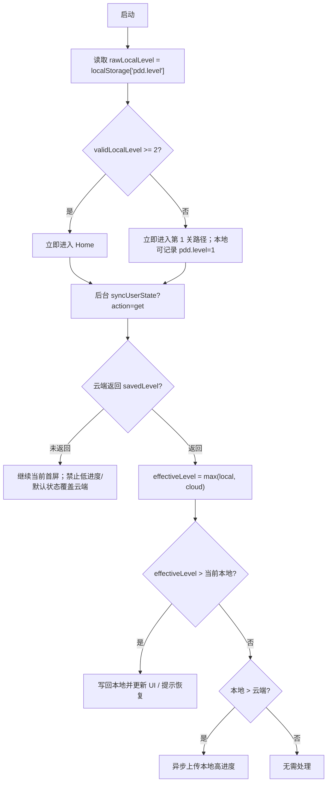
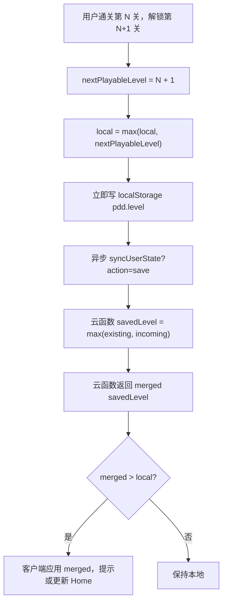
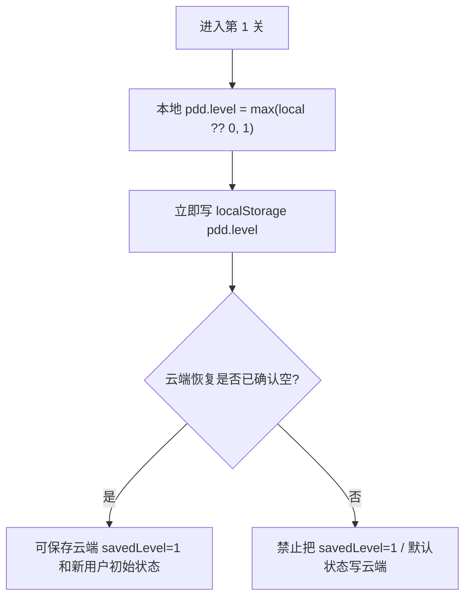

# 微信小游戏 A/B/C 用户启动、包体与进度同步方案

本文是目标方案，不是当前代码现状说明。后续如果实现与本文冲突，以本文作为修复和评审基准。

## 1. 目标

本方案解决四类问题：

1. 真新用户必须最快进入第 1 关，不能因为老用户恢复逻辑被拖慢或卡死。
2. 正常老用户必须最快进入主页，不能被云端请求阻塞首屏。
3. 删包/清缓存回流老用户不能永久丢进度，也不能被第 1 关低进度覆盖云端高进度。
4. 多设备、弱网、上传失败时，主线进度只能前进，不能回退。

核心原则：

```text
主线进度是单调递增值。
本地和云端共同参与合并。
最终有效进度 = max(本地有效进度, 云端有效进度)。
任何自动同步都不能把高进度覆盖成低进度。
```

这里的“云端”只指 `user_profile.savedLevel`。排行榜、微信好友云存储、埋点、CDN 都不是主线进度源。

## 2. 术语与精确定义

### 2.0 主线进度字段语义

`pdd.level`、`user_profile.savedLevel`、`UserProfile.lastLevelId` 在本文中使用同一个语义：

```text
用户当前可继续玩的主线关卡。
Home 主按钮显示“第 X 关”时，X 就应该等于这个值。
```

因此它不是“已经完成的关卡号”，也不是“当前正在运行的棋盘号”的纯运行时状态。它表示用户下一次从主线入口继续时应该进入哪一关。

标准变化规则：

| 用户行为 | `pdd.level` / `savedLevel` 目标值 |
|---|---:|
| 从未开始主线 | `null` / 字段不存在 |
| 第一次进入第 1 关 | `1` |
| 第 1 关进行中 | `1` |
| 通关第 1 关，解锁第 2 关 | `2` |
| 第 2 关进行中 | `2` |
| 通关第 N 关，解锁第 N+1 关 | `N + 1` |

这个定义下，`level = 1` 是一个正常值，表示“用户当前应继续第 1 关”。但它不能证明用户是老用户，也不能用于 Home 首屏路由。

也就是说：

```text
刚打开、还没有进入主线：rawLocalLevel === null。
一旦进入第 1 关：pdd.level 可以变成 1。
通关第 1 关并解锁第 2 关：pdd.level 必须提升到 2。
```

`null` 和 `1` 的区别必须保留：

```text
null = 这个设备还没有记录过主线入口。
1 = 这个设备或云端明确记录：当前可继续第 1 关。
```

关键保护：

```text
本地进入第 1 关可以把 pdd.level 写成 1。
但在云端恢复未决时，不能把 savedLevel=1 或默认用户状态写到云端覆盖可能存在的高进度。
```

### 2.1 本地进度

本地主线进度只看：

```ts
rawLocalLevel = sys.localStorage.getItem('pdd.level')
```

解析规则：

```ts
parsedLocalLevel =
  rawLocalLevel === null
    ? null
    : Math.floor(Number.parseInt(rawLocalLevel, 10))

validLocalLevel =
  Number.isFinite(parsedLocalLevel) && parsedLocalLevel >= 1
    ? parsedLocalLevel
    : null
```

精确含义：

| 条件 | 含义 |
|---|---|
| `rawLocalLevel === null` | 这个设备本地没有主线进度记录。常见于真新用户、删包回流老用户、清缓存。 |
| `validLocalLevel === 1` | 本地知道用户当前可继续第 1 关。它是正常进度值，但不是老用户 Home 路由依据。 |
| `validLocalLevel >= 2` | 这个设备本地有可用于首屏路由的老用户进度。 |
| `rawLocalLevel !== null` 但解析失败 | 脏数据，按 `validLocalLevel = null` 处理，不允许覆盖云端。 |

`getSavedLevel()` 这类默认返回 `1` 的方法只能用于决定“没有本地记录时默认进入第 1 关”，不得用于判断“本地是否真实存在 `pdd.level` 记录”。判断本地是否已有记录必须看 `rawLocalLevel`。

本文后续使用两个派生概念：

```ts
hasLocalProgressRecord =
  rawLocalLevel !== null && validLocalLevel !== null

hasLocalHomeRouteLevel =
  validLocalLevel !== null && validLocalLevel >= 2
```

其中 `hasLocalProgressRecord` 代表“本设备有真实主线记录”，`hasLocalHomeRouteLevel` 才代表“本设备足以直接走 Home 老用户首屏”。`validLocalLevel === 1` 只满足前者，不满足后者。

### 2.2 云端进度

云端主线进度只看：

```ts
cloudLevel = user_profile.savedLevel
```

解析规则：

```ts
validCloudLevel =
  Number.isFinite(cloudLevel) && cloudLevel >= 1
    ? Math.floor(cloudLevel)
    : null
```

`validCloudLevel === 1` 表示云端知道用户当前可继续第 1 关。它可以是正常新用户状态，但不能覆盖本地或云端已有的更高进度。

`cloudLevel <= 0`、非数字、缺字段都不代表有效用户进度，统一按 `validCloudLevel = null` 处理。

启动决策必须写清楚：

```text
如果 validLocalLevel >= 2：
  首屏先以本地进度进 Home，云端返回后再 max(local, cloud) 合并。

如果 validLocalLevel 为 null 或 1：
  本地不能证明是老用户，首屏先按第 1 关路径启动。
  云端如果返回 >= 2，再恢复到云端高进度。
  云端如果返回 null、1、0、-1 或脏值，继续第 1 关。
```

也就是说，云端无效值不会把用户路由到第 0 关，也不会触发任何重置逻辑。真要重置线上用户，直接删除该用户的 `user_profile` 记录；普通客户端 `save` 里不能夹带 reset/sentinel 逻辑。

### 2.3 有效进度

本地与云端合并：

```ts
effectiveLevel = Math.max(validLocalLevel ?? 0, validCloudLevel ?? 0)
```

含义：

| `effectiveLevel` | 含义 |
|---|---|
| `0` | 本地和云端都没有有效主线进度。启动可以进入第 1 关，并在本地记录为 `1`。 |
| `1` | 用户当前可继续第 1 关。仍然不能当作老用户 Home 路由依据。 |
| `>= 2` | 用户当前可继续第 N 关，应当被视为老用户，主页主按钮和本地存档应更新到该关卡。 |

## 3. 总体规则

### 3.1 进度源规则

1. 本地 `pdd.level` 是快速启动缓存和离线进度来源。
2. 云端 `user_profile.savedLevel` 是跨设备同步来源。
3. 最终有效进度取两者最大值。
4. 云函数保存时必须执行 `max(existing.savedLevel, incoming.savedLevel)`。
5. 客户端保存本地时也必须执行 `max(currentLocalLevel, incomingLevel)`。
6. 云函数 `save` 必须返回合并后的 `savedLevel`，客户端收到更高值必须应用回本地。
7. 进入第 1 关时可以写本地 `pdd.level=1`；通关第 N 关时写入 `N+1`。

### 3.2 禁止事项

1. 禁止用云端低进度覆盖本地高进度。
2. 禁止在云端恢复未决时用第 1 关 fallback 状态覆盖云端高进度。
3. 禁止用排行榜 `progressLevel` 作为启动恢复来源。
4. 禁止用 `wx.getUserCloudStorage` 作为启动恢复来源。
5. 禁止启动时把系统赠送道具、默认金币、默认体力等“合成默认状态”写回云端覆盖老用户状态。
6. 禁止首关启动依赖 CDN 关卡数据。
7. 禁止首屏前下载 `gameAssets`。

### 3.3 好友排行榜规则

微信好友排行榜可以使用：

```ts
wx.setUserCloudStorage({ key: 'score', value: ... })
```

但它只作为好友榜展示出口。它不是主线存档来源。

主域不应使用：

```ts
wx.getUserCloudStorage()
```

来决定用户启动进度。旧的“读好友榜防降级”逻辑应删除，因为它引入了第二套进度真源。

## 4. 包体职责划分

资源链路也要遵守单一职责：

```text
首屏只保命。
分包只承载稳定后续功能。
CDN 只承载动态关卡数据。
云函数只承载用户状态和业务数据。
```

### 4.1 Root / 微信上传主包

职责：

1. 微信小游戏启动壳。
2. 平台适配代码。
3. Cocos 运行时入口和最小 settings。
4. 必须随启动可用的最小路由代码和 `Boot.scene` 静态资源。

不应包含：

1. Home 大图和主页功能面板。
2. 排行榜、图鉴、商店、签到、主题挑战等后续功能资源。
3. 后续关卡动态 JSON 数据。

### 4.2 `main`

职责：

1. `main` 是 Cocos Creator 构建出来的默认主 bundle，在微信小游戏中被放入 `subpackages/main`。
2. 当前目标阶段，`main` 只承载启动第一口气必须用到的场景和脚本。
3. 当前 release 构建口径中，`main` 只包含 `Boot.scene` 和启动路由脚本；不要在文档中把已经合并或不存在的 `Loading.scene` 当作独立启动依赖。
4. `Game.scene` 归属 `bootstrap/firstPlay`，表示首关运行所需的场景骨架、控制器挂载点和 Cocos 保存的稳定节点，不表示后续玩法大资源都应进入 `main`。

当前如果 `main` 被放在：

```json
"preloadBundles": ["bootstrap", "main"]
```

那么它会计入启动下载量。拆成分包只能降低微信硬主包，不会自动降低启动下载量。

长期优化方向：

1. 继续压缩 `main`。
2. 将真正启动路由拆到更小的 Boot / Router 层。
3. 评估取消 `main` preload，让 A/B/C 根据路由再加载对应场景。

这属于结构性改造，不能和 P0 止血混在一起做。

### 4.3 `bootstrap`

职责：

`bootstrap` 是首关本地保障层。它只放第 1 关在无 CDN、无 `gameAssets` 情况下启动所需的同步资源。

必须包含：

1. `LevelData/level_1` 或等价首关本地快照。
2. 豆子图集和首关棋盘绘制必需贴图。
3. 首关背景、HUD、槽位、进度条、锁槽等首关可视资源。
4. 首关同步教程必需资源，例如 `guide_hand`。
5. 首关或极早期同步会访问的高亮资源，例如 `popup_guide_highlight_ring`，前提是代码确实会同步使用。

是否进入 `bootstrap` 的判定标准：

```text
首关首屏前或首关教程同步路径会访问 -> 必须进 bootstrap。
只在后续弹窗、排行榜、图鉴、商店、主题、结算中访问 -> 不进 bootstrap。
不确定 -> 先查调用链和构建产物，不能靠猜。
```

`popup_guide_bubble` 的规则：

1. 当前目标方案中，`popup_guide_bubble` 不进入 `bootstrap`。
2. 首关 `startTutorial('level_1')` 使用 `Game.scene` 中的 `TutorialGuidePrompt` 和 `guide_hand`，不是使用 `popup_guide_bubble`。
3. 新版排行榜 prefab 不依赖 `popup_guide_bubble`。
4. `_drawBubbleBg()` 属于旧气泡绘制逻辑，当前不作为首屏资源依据。
5. `showToastAt()` 仍可能引用 `popup_guide_bubble` 作为旧式 toast 背景；该资源应留在 `gameAssets`，后续可以单独评估是否删除旧 toast 图片依赖或改成轻量本地提示。
6. 如果未来首关教程被改成同步依赖 `popup_guide_bubble`，必须同步调整 `bootstrap` 或改回 scene-authored 轻量引导；不能让首关同步缺图。

### 4.4 `homeAssets`

职责：

1. `Home.scene`。
2. 主页标题、主页背景、主页按钮、主页稳定 UI。
3. 老用户首屏 Home 必需资源。

不应包含：

1. 第 1 关保命资源。
2. 后续玩法大资源。
3. 关卡 CDN 数据。

### 4.5 `gameAssets`

职责：

1. 后续玩法资源。
2. 后续弹窗、排行榜、图鉴、商店、签到、主题等稳定功能资源。
3. 非首关首屏必需的贴图、prefab、音效、特效。

启动要求：

```text
A 真新用户首关出现前不得下载 gameAssets。
B 老用户 Home 出现前不得下载 gameAssets。
C 删包回流用户恢复判断前不得下载 gameAssets。
```

### 4.6 CDN

职责：

1. `level_live.json`。
2. 分段关卡 pack。
3. 关卡 manifest。
4. 动态关卡投放、难度曲线和少量运营配置。

不应承载：

1. 首关必需稳定 UI。
2. 首关必需图片、prefab、音效、特效。
3. Home 首屏稳定资源。

首关启动规则：

```text
level_1 必须可在本地 bootstrap 启动。
CDN 失败不能导致真新用户首关打不开。
```

## 5. A/B/C 用户分类

### 5.1 启动时先按本地分支快速路由

启动不能等待所有云端状态都返回后才决定首屏。启动时本地只能分出两条快速路由：

```text
hasLocalHomeRouteLevel === true:
  立即进 Home。

hasLocalHomeRouteLevel === false:
  立即按第 1 关路径启动。

无论哪个分支:
  并行请求 syncUserState?action=get。
```

这样 B 能快进 Home，A/C 候选用户能快进第 1 关。注意：云端返回前，`validLocalLevel === null || validLocalLevel === 1` 只能说明“本地不能直接走 Home”，还不能最终判定是 A 还是 C。

进入第 1 关路径时，本地可以记录：

```text
pdd.level = max(validLocalLevel ?? 0, 1)
```

但如果云端恢复还没有确认空，不能把 `savedLevel=1` 或默认道具/金币/体力状态写入云端。

### 5.2 A 类：真新用户 / 早期新用户

云端返回后的最终定义：

```text
validLocalLevel === null || validLocalLevel === 1
并且
validCloudLevel === null || validCloudLevel === 1
```

A 类的本质是：

```text
effectiveLevel <= 1
```

也就是用户当前只应该继续第 1 关。

典型情况：

| 情况 | 本地 | 云端 | 处理 |
|---|---:|---:|---|
| 首次打开，云端确认空 | null | null | 进入第 1 关；本地写 `pdd.level=1`；允许创建云端 `savedLevel=1`。 |
| 首次打开，云端还没返回 | null | pending | 进入第 1 关；本地可写 `pdd.level=1`；云端低进度和默认状态写入必须阻塞/延迟。 |
| 第 1 关进行中 | 1 | null / 1 | 继续第 1 关。 |
| 第 1 关通关 | 1 | null / 1 | 本地提升到 `2`；云端保存用 `max(existing, 2)`。 |

A 类首屏依赖：

| 来源 | 是否依赖 | 内容 |
|---|---|---|
| Root | 是 | 启动壳、运行时代码、settings |
| `main` | 是 | Boot.scene 和启动脚本 |
| `bootstrap` | 是 | level_1 和首关同步资源 |
| `homeAssets` | 否 | 不应下载 |
| `gameAssets` | 否 | 不应下载 |
| CDN | 否 | 首关不依赖 |
| 云函数 | 异步 | 只用于确认是否真新，不阻塞首关首屏 |

A 类写入规则：

1. 进入第 1 关可以写本地 `pdd.level=1`。
2. 进入第 1 关不等于“可以把默认状态写云端”。
3. 只有云端确认空，才允许把新用户初始状态写成云端 `savedLevel=1`。
4. 第 1 关通关后，应保存 `2`，不是保存 `1`。
5. 所有保存必须经过云端 `max` 合并，不能覆盖已有高进度。

### 5.3 B 类：正常老用户

精确定义：

```text
validLocalLevel >= 2
```

启动路径：

```text
Boot / Router
-> 立即 Home
-> 后台请求 syncUserState?action=get
-> effectiveLevel = max(validLocalLevel, validCloudLevel)
```

B 类首屏依赖：

| 来源 | 是否依赖 | 内容 |
|---|---|---|
| Root | 是 | 启动壳、运行时代码、settings |
| `main` | 当前阶段是 | Boot / Router / Home 路由所需最小代码和启动场景骨架 |
| `homeAssets` | 是 | Home.scene 和主页 UI |
| `bootstrap` | 当前阶段会下载 | 因为统一预加载；长期目标是减少这个对 B 的成本 |
| `gameAssets` | 否 | Home 出现前不应下载 |
| CDN | 否 | Home 出现前不应请求 |
| 云函数 | 异步 | 不阻塞 Home 首屏 |

B 类同步规则：

| 场景 | 本地 | 云端 | 正确结果 |
|---|---:|---:|---|
| 同设备正常 | 10 | 10 | 保持 10 |
| 另一设备进度更高 | 10 | 100 | 更新本地到 100，Home 显示第 100 关 |
| 本设备弱网上传失败，本地更高 | 11 | 10 | 保持 11，重新上传 11 |
| 云端暂时不可用 | 11 | 未知 | 先按 11 进入 Home，云恢复后再合并 |

B 类点击“开始”时的规则：

1. Home 首屏不等云。
2. 如果云端请求仍 pending，点击主按钮时可以短等一个很小窗口，例如 300ms 到 800ms。
3. 小窗口内云端返回更高进度，则进入更高关卡。
4. 小窗口仍未返回，则按当前本地进度进入，云端晚到后不热切棋盘，只在安全边界更新 Home 或提示“进度已同步到第 X 关”。

### 5.4 C 类：删包 / 清缓存回流老用户

云端返回后的最终定义：

```text
validLocalLevel === null || validLocalLevel === 1
并且
validCloudLevel >= 2
```

启动路径：

```text
Boot / Router
-> hasLocalHomeRouteLevel === false，所以先按第 1 关路径启动
-> 后台 syncUserState?action=get 返回 cloudLevel
-> effectiveLevel = max(validLocalLevel ?? 0, cloudLevel)
-> 写回本地 pdd.level
-> 回 Home
-> 提示“已恢复进度到第 X 关”
```

C 类首屏依赖：

| 来源 | 是否依赖 | 内容 |
|---|---|---|
| Root | 是 | 启动壳、运行时代码、settings |
| `main` | 是 | Boot.scene 和启动脚本 |
| `bootstrap` | 是 | 第 1 关 fallback 所需资源 |
| `homeAssets` | 云端恢复后需要 | 恢复到 Home 时下载 |
| `gameAssets` | 否 | 恢复前不应下载 |
| CDN | 否 | fallback 第 1 关不依赖 |
| 云函数 | 是，但异步 | `syncUserState?action=get` |

C 类保护规则：

1. `validLocalLevel === null || validLocalLevel === 1` 时启动出来的第 1 关可以作为 fallback。
2. fallback 的本地 `pdd.level=1` 不是云端权威进度，不能覆盖云端高进度。
3. 云端未返回前，不允许把合成默认状态写回云端覆盖老用户状态。
4. 云端高进度晚到时，当前阶段允许直接回 Home，但必须给出 2-3 秒明确提示，例如“已恢复进度到第 76 关”。
5. 这类提示用于低概率 C 类用户，避免静默跳转；不为此引入复杂的棋盘交互状态机。

## 6. 各种边界场景处理

| 场景 | 本地 `pdd.level` | 云端 `savedLevel` | 正确处理 |
|---|---:|---:|---|
| 真新用户首次打开 | null | null | 进第 1 关；本地写 1；云端确认空后允许创建 `savedLevel=1`。 |
| 真新用户云端慢 | null -> 1 | pending | 先进第 1 关；本地可写 1；禁止把低进度和默认状态写云端；云端晚到再合并。 |
| 第 1 关进行中 | 1 | null / 1 | 继续第 1 关。 |
| 第 1 关通关 | 1 -> 2 | null / 1 / pending | 本地写 2；云端保存用 `max(existing, 2)`。 |
| 删包回流老用户 | null -> 1 | 76 | 可先第 1 关 fallback；云端返回后恢复到 76，提示并回 Home。 |
| 本地第 1 关，云端高进度 | 1 | 76 | 按 C 类处理，恢复到 76。 |
| 手机本地低，电脑已上传高 | 10 | 100 | 先 Home 显示 10；云端返回后更新到 100。 |
| 手机本地高，云端上传失败停低 | 11 | 10 | 保持 11，上传 11；绝不回退到 10。 |
| 两台设备都离线各自前进 | 手机 10，电脑 100 | 云端仍旧 | 谁先联网上传高值，云端变高；另一台下次合并取 max。 |
| 本地脏值 | abc | 100 | 本地按无效处理，恢复 100。 |
| 云端脏值 | 20 | abc/null | 保持 20，上传 20。 |
| 云函数保存低值 | 100 | incoming 2 | 云函数返回 100，客户端保持 100。 |
| 云端脏低值 | null / 1 | 0 / -1 | 云端按无效处理；本地不能进 Home 时继续第 1 关。 |

## 7. 同步流程

### 7.1 启动流程



### 7.2 用户通关保存流程



### 7.3 进入第 1 关保存流程



### 7.4 云端慢返回时的 UI 策略

| 当前界面 | 云端返回更高进度 | 处理 |
|---|---|---|
| Loading | 直接按更高进度进 Home。 |
| Home | 更新主按钮和本地状态，可轻提示“进度已同步到第 X 关”。 |
| 第 1 关 fallback | 回 Home，并显示 2-3 秒“已恢复进度到第 X 关”。 |
| 普通游戏关卡 | 不强行热切；在结算、退出、回 Home 时应用高进度。 |

## 8. 写入保护

需要区分两种写入：

### 8.1 主线进度写入

主线进度是单调值，可以随真实进度事件写入。

条件：

```text
用户进入第 1 关、本地已有有效高进度需要补写云端、或用户通关第 N 关解锁第 N+1 关。
```

保护：

```text
客户端 max。
云函数 max。
云函数返回 merged。
客户端应用 merged。
```

特殊规则：

```text
进入第 1 关可以写本地 pdd.level=1。
只有云端确认空后，才允许把 savedLevel=1 写入云端。
通关第 N 关时写 N+1。
```

### 8.2 合成默认状态写入

合成默认状态包括：

1. 新用户默认道具。
2. 默认体力。
3. 默认金币。
4. 默认签到状态。
5. 默认主题状态。

这些不能在云端未确认时写入。

允许写入条件：

```text
云端确认没有用户状态。
或用户发生真实行为并且写入逻辑是字段级 merge，不会用默认值覆盖已有云端值。
```

不允许写入的典型情况：

```text
本地从 null fallback 到第 1 关，但 syncUserState?action=get 仍未返回。
此时本地可以是 pdd.level=1，但云端不能写 savedLevel=1，也不能写默认道具/金币/体力覆盖老用户状态。
```

## 9. 打包策略按用户分层

### 9.1 A 类包链路

```text
Root
+ main
+ bootstrap
```

不允许：

```text
homeAssets
gameAssets
level-data CDN
排行榜云函数
wx.getUserCloudStorage
```

目标：

```text
首关可见前只下载启动必需资源。
第 1 关不因为 CDN 或 gameAssets 失败而打不开。
```

### 9.2 B 类包链路

```text
Root
+ main
+ bootstrap 当前阶段会被统一预加载
+ homeAssets
```

不允许：

```text
gameAssets 在 Home 首屏前下载。
level-data CDN 在 Home 首屏前请求。
云端 syncUserState 阻塞 Home 首屏。
```

目标：

```text
老用户先看到 Home。
云端同步只更新进度，不阻塞首屏。
```

### 9.3 C 类包链路

云端返回前：

```text
Root
+ main
+ bootstrap
```

云端确认高进度后：

```text
+ homeAssets
```

不允许：

```text
gameAssets 在恢复判定前下载。
level-data CDN 在 fallback 第 1 关前请求。
低进度或默认状态写云端。
```

目标：

```text
删包回流用户即使先看到第 1 关，也不能丢进度。
云端高进度回来后应恢复到 Home / 高进度。
```

## 10. 包体预算

当前会议口径建议使用两条线：

```text
微信硬限制线：启动下载量 < 3072KB。
工程安全线：启动下载量 < 2950KB。
```

原因：

1. 只剩十几 KB 余量时，新增一张图片、一个 meta、一个配置变化都可能超线。
2. `bootstrap` 在 root 中，任何新增都会影响所有用户。
3. `main` 如果仍在 `preloadBundles`，也会影响所有用户启动下载量。

新增资源进入 `bootstrap` 的审批标准：

```text
必须给出首关同步调用证据。
必须通过构建产物检查。
必须验证 A 类首关无缺图。
必须验证启动下载量仍低于工程安全线或说明例外。
```

## 11. 验证标准

### 11.1 自动校验

必须覆盖：

1. `settings.assets.preloadBundles` 不包含 `homeAssets` / `gameAssets`。
2. `game.json.subpackages` 包含 `homeAssets` / `gameAssets`。
3. `bootstrap` 包含首关同步必需资源。
4. `bootstrap` 不包含排行榜、图鉴、商店、签到、主题挑战等后续功能资源。
5. A 类首关出现前不下载 `gameAssets`。
6. B 类 Home 出现前不下载 `gameAssets`。
7. 首关不请求关卡 CDN。
8. 启动下载量低于预算。
9. 启动恢复代码不读取 `leaderboard.progressLevel` 作为主线进度。
10. 主域代码不读取 `wx.getUserCloudStorage` 作为主线进度。
11. 云函数保存 `savedLevel` 使用 `max(existing, incoming)`。
12. 云端 `savedLevel <= 0` 或脏值只按无效进度处理，不触发普通客户端 reset。

### 11.2 手工/真机用例

| 用例 | 操作 | 期望 |
|---|---|---|
| A1 真新用户 | 清缓存、云端无 `user_profile.savedLevel` | 快速进入第 1 关；本地 `pdd.level=1`；云端确认空后可写 `savedLevel=1`；无 `gameAssets`；无 CDN 首关依赖。 |
| A2 新用户弱网 | 云函数慢或失败 | 仍能进入第 1 关；本地可为 1；云端未确认前不写 `savedLevel=1` 和默认状态。 |
| A3 第 1 关通关 | 从第 1 关胜利结算 | 本地提升为 `pdd.level=2`；云端保存 `max(existing, 2)`。 |
| B1 正常老用户 | 本地 `pdd.level=10` | 快速进 Home；后台同步不挡首屏。 |
| B2 跨设备云端更高 | 本地 10，云端 100 | 先 Home；云回后 Home 更新到 100。 |
| B3 本地更高云端更低 | 本地 11，云端 10 | 不回退；上传 11。 |
| C1 删包回流 | 本地 null，云端 76 | 可 fallback 第 1 关并本地写 1；云端返回后恢复 76；不能保存 1 覆盖云端。 |
| C2 云端晚到 | 本地 null -> 1，云端 76 延迟返回 | 用户已看到第 1 关也可以回 Home，但必须提示“已恢复进度到第 76 关”。 |
| C3 云端不可用 | 本地 null -> 1，云端未知 | 先玩第 1 关；云恢复后 max 合并。 |

## 12. 分阶段落地建议

### P0：数据与资源止血

1. 主线进度只认 `pdd.level` 和 `user_profile.savedLevel`。
2. 字段语义统一为“当前可继续玩的主线关卡”。
3. 进入第 1 关可本地写 1；通关第 N 关写 N+1。
4. 合并规则统一为 `max(local, cloud)`。
5. 云函数 `save` 保证单调递增并返回 merged。
6. 客户端收到 merged 高进度必须应用。
7. 删除主域 `wx.getUserCloudStorage` 进度读取。
8. 排行榜只做展示，不参与启动恢复。
9. `bootstrap` 补齐首关同步必需资源。
10. 首屏前禁止下载 `gameAssets`。
11. 删除普通客户端 save 中的 `savedLevel <= 0` reset/sentinel 逻辑；低值只表示无效云端进度。

### P1：包体安全垫

1. 把启动下载量目标从“刚好小于 3072KB”改成“小于 2950KB”。
2. 压缩 `bootstrap` 大图和首关资源。
3. 对每个新增 bootstrap 资源要求同步调用证据。
4. 持续验证 A/B/C 首屏链路。

### P2：结构性启动优化

1. 拆出更小的 Loading / Router 启动层。
2. 评估取消 `main` preload。
3. A 根据需要加载 Game 首关。
4. B 根据需要加载 Home。
5. C 根据云端恢复结果加载 Home 或继续第 1 关。

P2 的目标是把启动下载量从“root + main”进一步压到“root + 最小 router”，但这是结构改造，需要 Cocos 场景和构建规则一起配合。

## 13. 会议结论建议

建议会议用以下结论收口：

```text
1. 进度不是云端覆盖本地，也不是本地覆盖云端，而是本地与云端取最大值。
2. pdd.level / savedLevel 表示“当前可继续玩的主线关卡”：进入第 1 关写 1，通关第 N 关写 N+1。
3. A/B/C 分类只决定首屏怎么快，不改变进度单调合并原则。
4. A 和 B 都应该快速首屏；C 可以 fallback，但不能丢进度。
5. bootstrap 只放首关保命资源；gameAssets 绝不能首屏前下载。
6. CDN 只放动态关卡数据，不能承载首关稳定 UI。
7. 排行榜和微信好友云存储不是主线存档。
8. 当前如果 main 仍被 preload，拆分 main 只能降低硬主包，不等于降低启动下载量。
9. 下一阶段真正的大收益是压缩 bootstrap/main，并评估取消 main preload。
```
