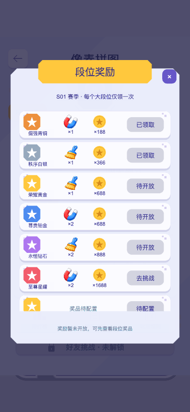
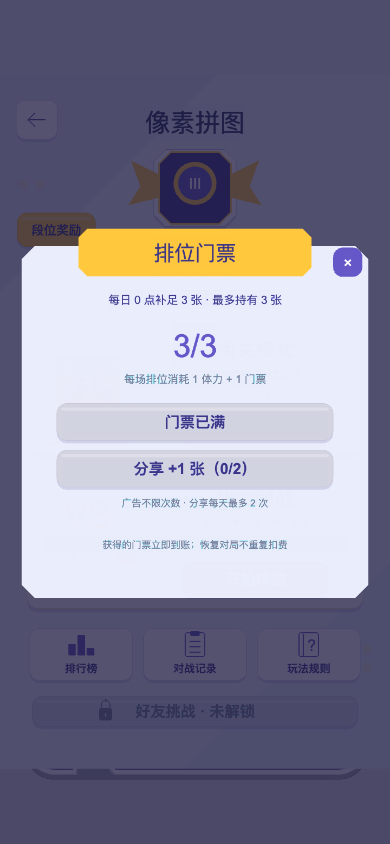

# PvP 门票与奖品：实现及验收记录

日期：2026-09-07。范围为本地客户端、云函数源码和隔离测试；未部署生产。

## 业务规则

- 新排位 1 体力 + 1 门票，恢复已创建对局不重复扣。
- 北京时间每日零点补足 3 张，容量 3，不跨天累加。
- 广告完成奖励 +1 张、无日次数限制；分享合格回调奖励 +1 张、每天成功领取最多 2 次。
- 六档奖品按参考图配置，每季每大段位一次；本赛季最高段位决定资格。王者截图不全，标记待配置。
- 当前赛季以服务端 `pvp_profiles.seasonId` 为准。本轮没有新增自动赛季轮换任务；切换赛季需由现有运营/赛季流程更新权威字段。

## 本地验证证据

- `npm run test:pvp`：八组全部通过，覆盖玩法、云端核心、异步生命周期、经济事务、客户端快照/弱网补领、实际节点 UI、像素路径和存档同步。
- 服务端测试调用真实 `pvpService.main`，数据库为串行事务及回滚 mock；它验证业务逻辑，不替代 CloudBase 多实例并发压测。
- 已覆盖：并发两次开局同一 matchId、只扣一次；没体力/门票不部分扣费；每日补足而非累加；广告不消耗分享额度；分享第三次拒绝；最后一个票位并发只发一张；重复授权/领取、越权、10 分钟授权过期和跨天失效；未完成平台回调不发票。
- 已覆盖：正式奖品关闭、未达段位拒绝、掉段保留资格、跨赛季重领和历史凭证保留、并发重复领奖一次到账；旧/伪造未来资产版本不能覆盖扣费/奖品，同版本仍可同步普通闯关收益。
- 客户端验证：高版本快照替换余额、重复快照不擦掉后续本地收益、非法快照不部分写入；弱网后保留同一领取编号，过期后解除补领阻塞。
- `theme-settled-pixel-entry.test.js` 与 `rewarded-grant-transaction.test.js` 通过；后者故意注入取消、超时和缺失模板错误，其断言通过不代表线上存在这些错误。
- 四个云端 JavaScript 文件语法检查通过，`git diff --check` 通过。

## Web 页面验收

### 本地领票模拟补充（2026-09-07）

- 本地浏览器预览的门票弹窗支持直接模拟广告、分享成功，每次 +1 张；底部明确显示本地模拟，不调用平台 SDK 或云函数。
- 复用原本的会话内预览余额：最多 3 张、分享每天 2 次、广告无日次数限制，北京时间跨零点补足门票并清空分享次数。刷新整个页面会重新初始化演示数据，不写入正式账号。
- 模拟接口检查现有平台标记，微信和抖音环境明确拒绝；正式环境的网络错误不会转成模拟奖励。正式待补领凭证不阻塞本地模拟，也不会被本地模拟删除。
- 新增回归测试覆盖本地 0→1→2→3、次数/禁用状态、大厅余额同步、重复点击、每日重置、广告反复领取，以及正式平台仍使用原授权/回调/领取流程；八组 `test:pvp` 全部通过。
- 本次补充仅做代码与节点交互逻辑测试，未重新构建 Web 或进行浏览器画面验收。以下浏览器记录、截图对应之前的页面版本。

- 新建两次 Cocos Web 构建，最终日志显示 `build Task (web-mobile) Finished in (34 s)`；CLI 沿用既有结束码 36，因此不将其记为标准零退出构建。
- 原 7456 编辑器预览的模块仍返回 HTTP 500，未对编辑器进程做重置。
- 新 Web 产物首次启动暴露既存 bootstrap 动画扩展索引缺失；复用项目 `ensureStandaloneCconExtensionMap` 修复生成的 `build/web-mobile/assets/bootstrap/config.json`，没有改动原始动画资产。每次重建 Web 需重新进行该产物修复。
- 在隔离 Chrome 中启动实际 Cocos Game，再调用已有大厅入口方法，仅用于新页面验收；并非本轮重新验证完整首页启动路由。
- 390×844 与 320×568 两种竖屏：真实鼠标点击打开段位奖励、滚动到王者行、点击关闭、打开补票弹窗、再次关闭与重开成功。
- 第一遍发现 Sprite 默认尺寸撑大遮挡数量、满票按钮外观仍可用；修复为固定尺寸图标、明确金币图案、灰色禁用按钮和覆盖长屏的输入遮罩，第二遍截图确认修复。
- 未出现脚本 `pageerror`。仍有浏览器自动播放限制、Cocos 废弃接口警告及未定位的 404 控制台消息；未把它们描述为“零日志”。
- Web 使用预览余额和奖品状态，不调用真实广告或分享，不授予真实奖品。以下为实际代码渲染截图，不是生成概念图。

## 部署与验收清单

1. 先备份目标环境相关配置和资产样本，不批量重置或迁移玩家余额。
2. 以 `cloudfunctions/pvpService/deployment-manifest.json` 为准：7 个 PvP 集合、9 个索引，并依赖已有 `user_profile`。本轮新增 `pvp_ticket_claims`、`pvp_rank_reward_claims`，客户端禁止直接读写。
3. 先协调部署资产版本保护的 `syncUserState`、`updateUserProfileAssets`，再部署含 `economy.js` 的 `pvpService`，配套发布新客户端；不能仅更新 UI。
4. `pvpService` 请求自动携带 `economyRevision`。独立 `updateUserProfileAssets` 工具调用需提供当前 `pvpEconomyRevision`；旧版本写入会拒绝，不能绕过版本检查重试。
5. `PVP_RANK_REWARDS_ENABLED=false` 为生产默认值。完整服务端成绩验证未修复前，不开启真实达段奖品；开发测试仅在隔离环境临时置 true。
6. `pvp:cloudbase:preflight` 的集合、接口、文件检查通过；本机缺少部署所需的凭据对，所以返回非零，未执行部署。路径校验允许等价的 `cloudfunctions/` 尾斜杠。
7. 在微信体验版用两个账号验证：真实广告完播/取消、分享返回、网络中断补领、跨日刷新、同账号多设备并发扣费、领奖后重启资产一致。现有客户端平台回调不是服务端完播证明，需另做平台凭证/风控验收。
8. 补齐王者奖励数值、成绩权威验证与赛季轮换验收。旧审查报告中的完整棋盘恢复、10 分钟对局过期等问题未被本轮一并修复。

未提交 Git、未推送、未打包微信版、未发布 CDN、未修改线上数据库。
